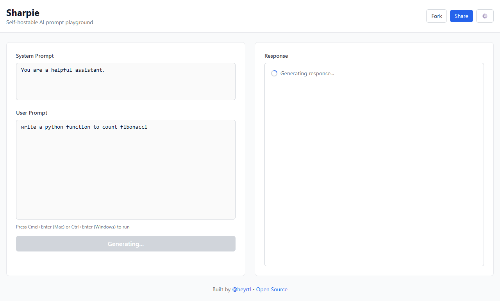
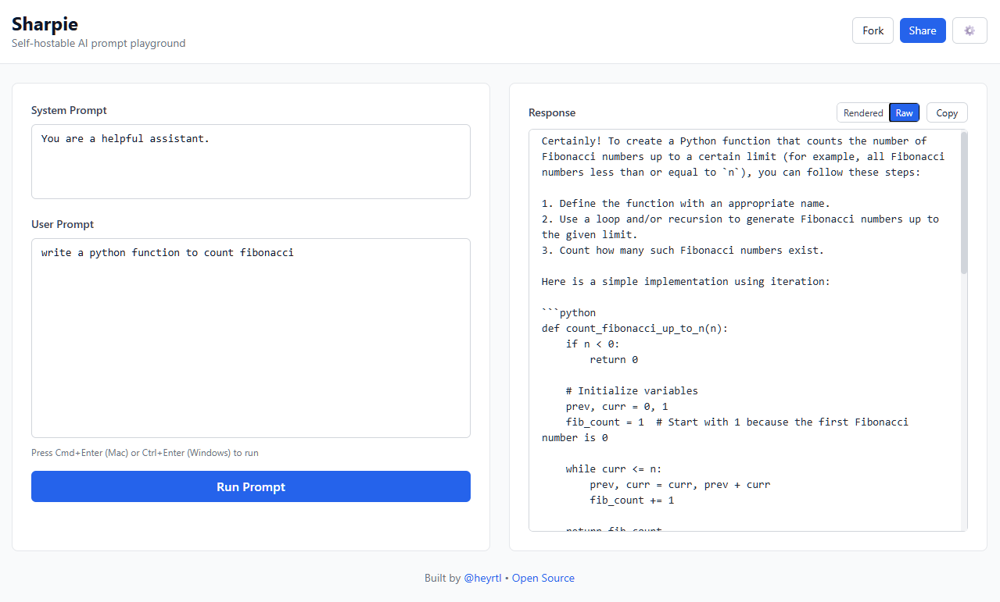
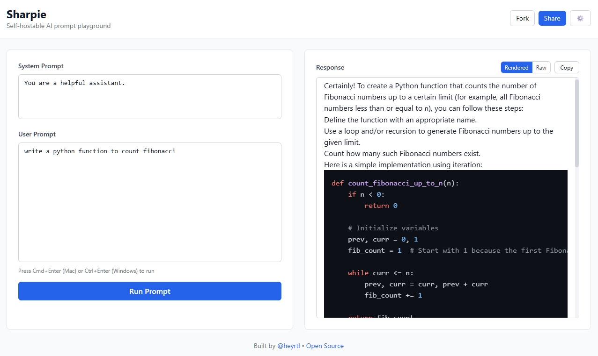
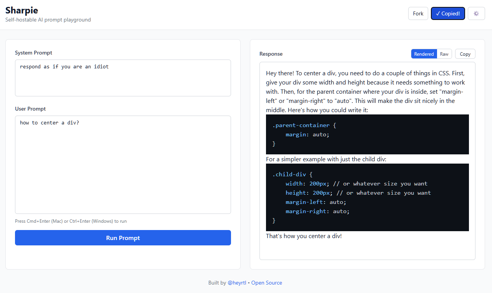
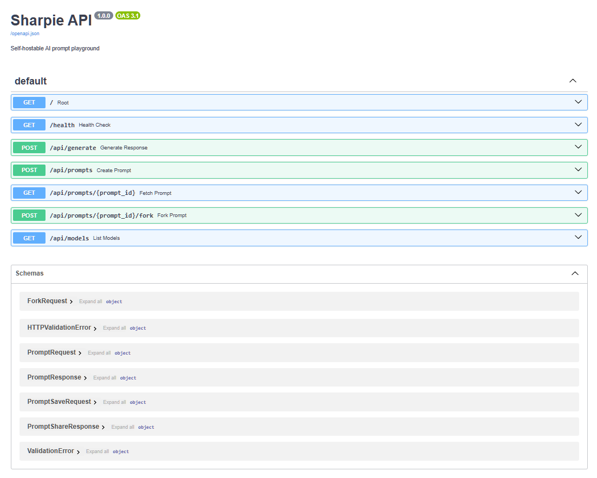
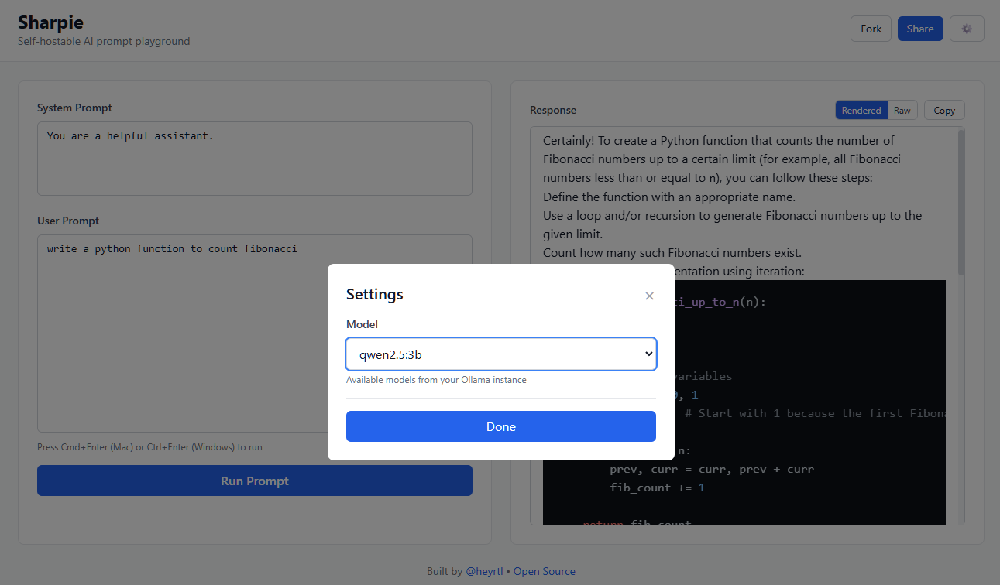

# Sharpie

> Self-hostable AI prompt playground with local LLM support

Build, test, and share AI prompts with zero API costs. Run entirely on your machine with Docker.

[](https://opensource.org/licenses/MIT)
[](https://www.docker.com/)
[](http://makeapullrequest.com)

## Features

- **One-command setup** - `docker-compose up` and you're running
- **Fully self-hosted** - Your prompts never leave your machine
- **Zero API costs** - Uses local Ollama models (qwen2.5:3b by default)
- **Share & Fork** - Generate shareable URLs for any prompt
- **Real-time streaming** - Watch AI responses generate live
- **Markdown rendering** - Beautiful formatted responses with syntax highlighting
- **GPU accelerated** - Leverages your NVIDIA GPU automatically
- **No dependencies** - Everything runs in Docker containers

## Screenshots

### Main Interface


### Response 




### Fork & Share



### Backend


### Settings


## Quick Start

### Prerequisites

- [Docker Desktop](https://www.docker.com/products/docker-desktop/) installed
- 10GB free disk space (for Ollama model)
- (Optional) NVIDIA GPU with CUDA support

### Installation

```bash
# Clone the repository
git clone https://github.com/heyrtl/sharpie.git
cd sharpie

# Start all services
docker-compose up --build
```

That's it! Open **http://localhost:5173** in your browser.

First run takes 5-10 minutes to download the Qwen2.5-3B model (~2GB).

## Usage

### Basic Workflow

1. **Write your prompts** - System and user prompts in the editor
2. **Run** - Press `Cmd/Ctrl + Enter` or click "Run Prompt"
3. **Share** - Click "Share" to get a shareable URL
4. **Fork** - Click "Fork" to create a copy and modify

### Sharing Prompts

Share URLs like `http://localhost:5173?p=abc123` with anyone running Sharpie. They can:
- View your prompt
- Run it with their local model
- Fork and modify it

### Switching Models

1. Click the settings icon
2. Select from available Ollama models
3. Models are auto-detected from your Ollama instance

## Architecture

```
Frontend (React + Vite)
    ↓
Backend (FastAPI)
    ↓
Ollama (Local LLM)
    ↓
SQLite (Prompt Storage)
```

- **Frontend**: React app with real-time streaming UI
- **Backend**: FastAPI server handling prompts and streaming
- **Ollama**: Local LLM inference with GPU acceleration
- **SQLite**: Embedded database for saved prompts

## Configuration

### Using Different Models

Pull any Ollama model:

```bash
docker exec -it sharpie-ollama ollama pull llama3.2:3b
docker exec -it sharpie-ollama ollama pull mistral:7b
```

Then select it in Settings.

### Environment Variables

Copy `.env.example` to `.env` and customize:

```bash
OLLAMA_HOST=http://ollama:11434
DATABASE_PATH=/app/data/sharpie.db
```

### GPU Support

GPU is auto-detected. To disable GPU and run CPU-only, remove the `deploy` section from `docker-compose.yml`.

## Development

### Project Structure

```
sharpie/
├── backend/           # FastAPI server
│   ├── main.py       # API routes
│   ├── database.py   # SQLite handlers
│   ├── models.py     # Pydantic models
│   └── utils.py      # Helpers
├── frontend/          # React app
│   └── src/
│       ├── App.jsx
│       ├── components/
│       └── utils/
└── docker-compose.yml
```

### Running Locally (without Docker)

**Backend:**
```bash
cd backend
pip install -r requirements.txt
uvicorn main:app --reload
```

**Frontend:**
```bash
cd frontend
npm install
npm run dev
```

Make sure Ollama is running separately.

## Troubleshooting

### Port Already in Use

Change ports in `docker-compose.yml`:

```yaml
ports:
  - "8001:8000"  # Backend
  - "5174:5173"  # Frontend
```

### Ollama Model Not Downloading

Manually pull the model:

```bash
docker exec -it sharpie-ollama ollama pull qwen2.5:3b
```

### GPU Not Detected

Check NVIDIA Docker runtime:

```bash
docker run --rm --gpus all nvidia/cuda:11.0-base nvidia-smi
```

If it fails, you may need to install `nvidia-container-toolkit`.

### Out of Disk Space

The Ollama model requires ~2GB. Free up space or use a smaller model:

```bash
docker exec -it sharpie-ollama ollama pull qwen2.5:0.5b
```

## Contributing

Contributions are welcome! Here's how:

1. Fork the repository
2. Create a feature branch (`git checkout -b feature/amazing-feature`)
3. Commit changes (`git commit -m 'Add amazing feature'`)
4. Push to branch (`git push origin feature/amazing-feature`)
5. Open a Pull Request

### Development Setup

See [CONTRIBUTING.md](CONTRIBUTING.md) for detailed setup instructions.

## Roadmap

- [ ] Multi-model API support (OpenAI, Claude, Gemini)
- [ ] Prompt versioning and history
- [ ] Collaborative editing
- [ ] Export prompts as JSON
- [ ] Prompt analytics
- [ ] Browser extension
- [ ] Model comparison view

## Security

See [SECURITY.md](SECURITY.md) for security considerations and best practices.

## License

MIT License - see [LICENSE](LICENSE) for details.

## Author

**Ratul Rahman** ([@heyrtl](https://twitter.com/heyrtl))

- Website: [ratul-rahman.com](https://ratul-rahman.com)
- GitHub: [@heyrtl](https://github.com/heyrtl)
- Twitter: [@heyrtl](https://twitter.com/heyrtl)

## Acknowledgments

- [Ollama](https://ollama.ai/) for local LLM inference
- [FastAPI](https://fastapi.tiangolo.com/) for the backend framework
- [React](https://react.dev/) for the frontend
- [Qwen](https://qwen.ai/) team for the excellent small language models

## Star History

If you find this useful, consider giving it a star!

---

Built with care for the prompt engineering community.